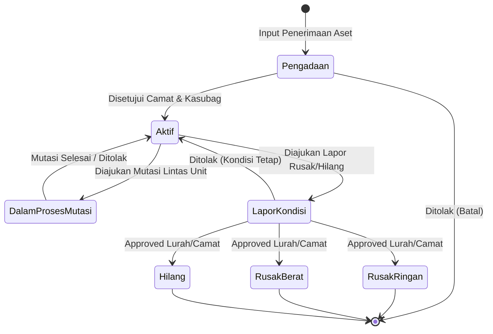
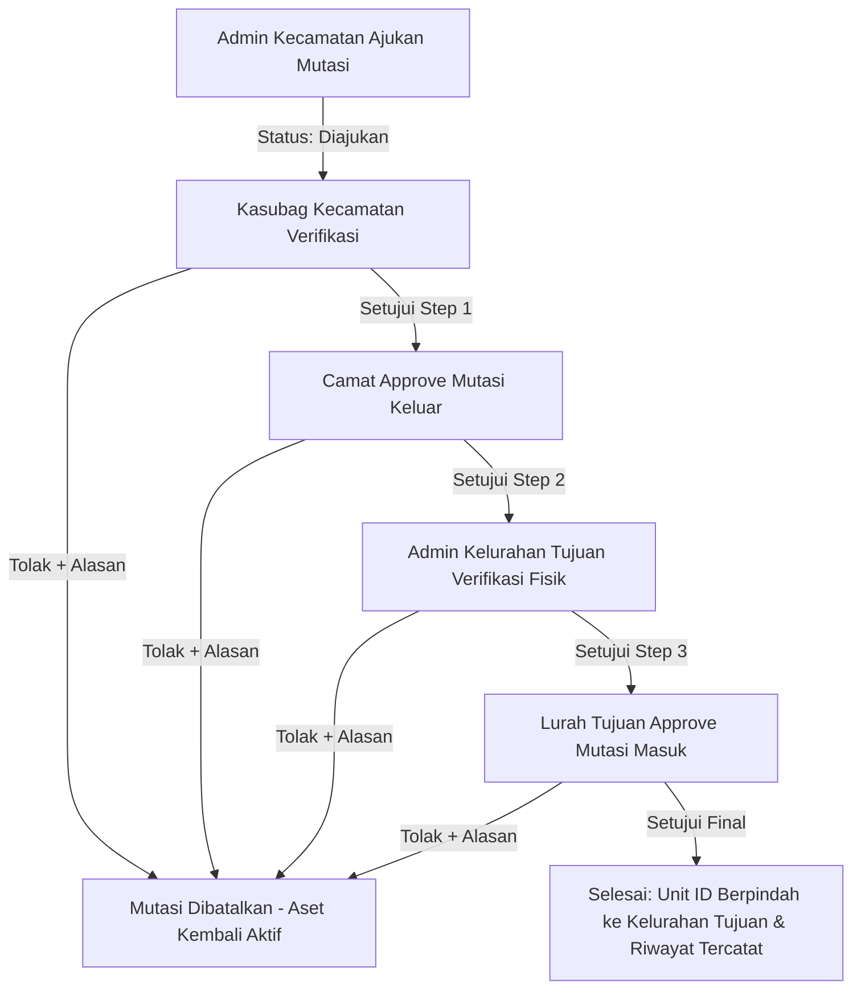
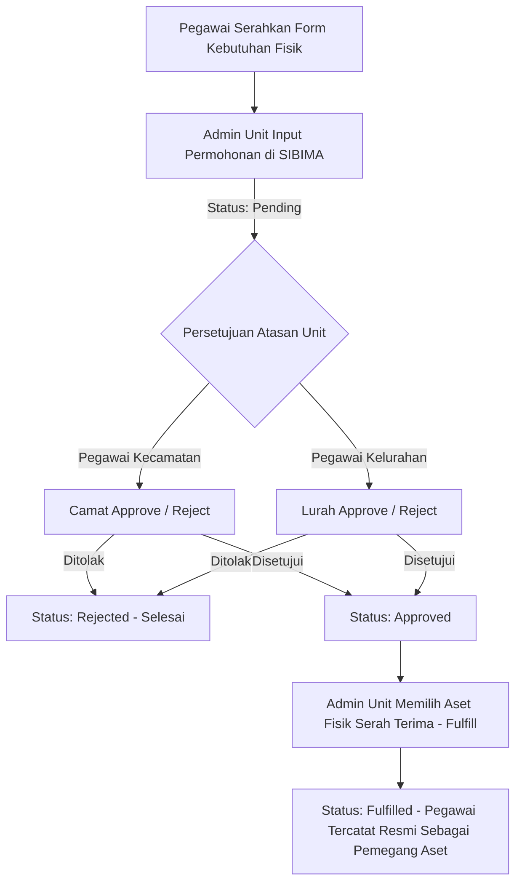

# PANDUAN LENGKAP DESAIN UI/UX SISTEM INFORMASI SIBIMA
## Sistem Informasi Barang Milik Daerah (Kecamatan Sagulung, Pemerintah Kota Batam)

Dokumen ini disusun sebagai acuan tunggal dan komprehensif bagi perancangan antarmuka (UI) dan pengalaman pengguna (UX) untuk aplikasi web **SIBIMA**. Seluruh rancangan berpegang pada prinsip desain kedinasan modern: fungsional, berwibawa, bersih, efisien, dan bebas dari elemen dekoratif berlebih (*anti-slop*).

---

## DAFTAR ISI
1. [Prinsip Desain & Identitas Visual](#1-prinsip-desain--identitas-visual)
2. [Panduan Warna (Color Guide)](#2-panduan-warna-color-guide)
3. [Panduan Tipografi (Typography Guide)](#3-panduan-tipografi-typography-guide)
4. [Sistem Grid, Spacing & Komponen Fondasi](#4-sistem-grid-spacing--komponen-fondasi)
5. [Struktur Navigasi & Hak Akses Pengguna (Role-Based)](#5-struktur-navigasi--hak-akses-pengguna-role-based)
6. [Katalog & Rincian Fitur Per Halaman](#6-katalog--rincian-fitur-per-halaman)
   - [6.1 Modul Autentikasi](#61-modul-autentikasi)
   - [6.2 Modul Dashboard Eksekutif & Ringkasan](#62-modul-dashboard-eksekutif--ringkasan)
   - [6.3 Modul Manajemen Data Aset (Katalog BMD)](#63-modul-manajemen-data-aset-katalog-bmd)
   - [6.4 Modul Master Kategori Aset (2-Level)](#64-modul-master-kategori-aset-2-level)
   - [6.5 Modul Manajemen Data Pegawai](#65-modul-manajemen-data-pegawai)
   - [6.6 Modul Penerimaan Aset Baru](#66-modul-penerimaan-aset-baru)
   - [6.7 Modul Mutasi Aset (4 Alur Lintas & Dalam Unit)](#67-modul-mutasi-aset-4-alur-lintas--dalam-unit)
   - [6.8 Modul Kotak Masuk Persetujuan (Approval Inbox)](#68-modul-kotak-masuk-persetujuan-approval-inbox)
   - [6.9 Modul Permohonan Kebutuhan Aset (Asset Request)](#69-modul-permohonan-kebutuhan-aset-asset-request)
   - [6.10 Modul Pelaporan Aset Rusak / Hilang (Asset Report)](#610-modul-pelaporan-aset-rusak--hilang-asset-report)
   - [6.11 Modul Pemindai Cepat QR Code (Kamera Browser)](#611-modul-pemindai-cepat-qr-code-kamera-browser)
   - [6.12 Modul Rekapitulasi & Ekspor Laporan Excel](#612-modul-rekapitulasi--ekspor-laporan-excel)
   - [6.13 Modul Profil Akun](#613-modul-profil-akun)
7. [Status Lifecycle & Diagram Alur Transaksi (User Flows)](#7-status-lifecycle--diagram-alur-transaksi-user-flows)

---

## 1. PRINSIP DESAIN & IDENTITAS VISUAL

### 1.1 Filosofi Desain: "Civic Authority & Operational Clarity"
* **Bermartabat & Berwibawa**: Mengedepankan identitas resmi Pemerintahan Kota Batam dan Kecamatan Sagulung.
* **Fokus pada Kerapian Data**: Menyajikan ribuan data aset, kode barang BMD, nomor register, dan riwayat mutasi dalam format yang mudah dipindai mata tanpa kelelahan visual.
* **Bebas AI-Slop**:
  * Dilarang menggunakan gradien ungu-sian atau bulatan cahaya melayang (*glow orbs*).
  * Dilarang menggunakan kartu bertumpuk di dalam kartu (*cards inside cards*).
  * Dilarang menggunakan tombol kapsul (*pill buttons*) di form transaksional.
  * Hindari teks pemasaran yang klise atau statistik palsu.
  * Bentuk radius sudut komponen konsisten pada ukuran 8px (*rounded-lg*).

### 1.2 Identitas Resmi Instansi
* **Nama Resmi Aplikasi**: SIBIMA
* **Kepanjangan**: Sistem Informasi Barang Milik Daerah
* **Sub-Instansi**: Kecamatan Sagulung, Pemerintah Kota Batam
* **Logo Resmi**: Berkas `docs/Lambang_Kota_Batam.png`
* **Wilayah Kerja Kelurahan**:
  1. Kelurahan Sungai Binti
  2. Kelurahan Sungai Lekop
  3. Kelurahan Sagulung Kota
  4. Kelurahan Sungai Pelunggut
  5. Kelurahan Tembesi
  6. Kelurahan Sungai Langkai

---

## 2. PANDUAN WARNA (COLOR GUIDE)

Palet warna menggunakan pendekatan institusional bertingkat (Deep Civic Navy dan Sapphire Blue) yang dipadukan dengan kanvas netral abu-terang untuk kenyamanan operasional harian staf.

### 2.1 Warna Utama (Primary Brand & Accent)

| Nama Token | Nilai Hex | Penggunaan Utama |
|---|---|---|
| **Civic Navy Dark** | `#0F2440` | Background panel kiri login, header navigasi utama, teks judul besar, identitas instansi |
| **Sapphire Blue** | `#1E40AF` | Tombol aksi utama (*primary CTA*), state aktif menu, fokus border input, highlight terpilih |
| **Sapphire Hover** | `#1D4ED8` | State hover pada tombol utama dan link interaktif |
| **Sapphire Dark** | `#172554` | State aktif / pressed pada tombol utama |
| **Light Tint** | `#EFF6FF` | Background baris tabel terpilih, badge mutasi, border aksen lembut |

### 2.2 Warna Permukaan & Kanvas (Surfaces & Neutrals)

| Nama Token | Nilai Hex | Penggunaan Utama |
|---|---|---|
| **App Canvas** | `#F8FAFC` | Latar belakang seluruh halaman aplikasi (Slate 50) |
| **Card Surface** | `#FFFFFF` | Latar belakang kartu kontainer, tabel, modal, dropdown |
| **Border Structural** | `#E2E8F0` | Garis pemisah baris tabel, border kartu, pemisah section |
| **Border Input** | `#CBD5E1` | Garis tepi input form standar, checkbox, dan select box |
| **Text Primary** | `#0F172A` | Teks judul, label field, nilai angka tabel (Slate 900) |
| **Text Secondary** | `#475569` | Teks pendukung, isi tabel standar, label kecil (Slate 600) |
| **Text Muted** | `#64748B` | Placeholder form, breadcrumb, header kolom tabel, timestamp |

### 2.3 Status Aset & Indikator Sistem (Semantic Feedback)

| Status | Teks Hex | Background Hex | Border Hex | Makna & Penggunaan |
|---|---|---|---|---|
| **Baik / Disetujui / Selesai** | `#047857` | `#ECFDF5` | `#A7F3D0` | Kondisi fisik baik, permohonan disetujui, mutasi tuntas |
| **Rusak Ringan / Menunggu** | `#B45309` | `#FFFBEB` | `#FDE68A` | Kerusakan ringan, butuh verifikasi admin, status pending |
| **Rusak Berat / Ditolak** | `#B91C1C` | `#FEF2F2` | `#FECACA` | Kerusakan fatal, laporan penolakan mutasi/request |
| **Aset Hilang** | `#4B5563` | `#F3F4F6` | `#D1D5DB` | Status barang hilang / proses pelaporan kehilangan |
| **Dalam Proses Mutasi** | `#1E40AF` | `#EFF6FF` | `#BFDBFE` | Aset sedang dikunci dalam alur mutasi atau verifikasi |

---

## 3. PANDUAN TIPOGRAFI (TYPOGRAPHY GUIDE)

* **Font Utama**: **Plus Jakarta Sans** (untuk seluruh Headline, Display, Judul Halaman)
* **Font Konten & Data**: **Inter** atau **Figtree** (untuk Form, Tabel Data, Label, Metadata)
* **Kaidah Angka**: Pada tabel kode barang, nomor register, nominal harga, dan NIP, aktifkan `font-variant-numeric: tabular-nums` agar seluruh angka sejajar tegak lurus secara rapi.

### Skala Tipografi

| Nama Token | Font Family | Ukuran / Line-Height | Weight | Penggunaan |
|---|---|---|---|---|
| **Display Title** | Plus Jakarta Sans | 32px / 40px | Bold (700) | Header brand login, judul halaman dashboard |
| **Page Title** | Plus Jakarta Sans | 24px / 32px | Bold (700) | Judul utama setiap modul halaman |
| **Section Title** | Plus Jakarta Sans | 18px / 26px | SemiBold (600) | Judul kartu, sub-bagian formulir, judul modal |
| **Body Regular** | Inter | 14px / 20px | Regular (400) | Teks isi deskripsi, paragraf umum, teks tabel |
| **Body Medium** | Inter | 14px / 20px | Medium (500) | Teks input form, teks tombol, opsi dropdown |
| **Form Label** | Inter | 13px / 18px | Medium (500) | Label di atas input field formulir |
| **Table Header** | Inter | 11px / 16px | SemiBold (600) | Header kolom tabel (Huruf Kapital, tracking 0.04em) |
| **Small Metadata** | Inter | 12px / 16px | Regular (400) | Catatan kaki, timestamp, teks helper validasi |

---

## 4. SISTEM GRID, SPACING & KOMPONEN FONDASI

### 4.1 Layout & Grid
* **Breakpoint Desktop**: Layar $\ge 1280\text{px}$. Sidebar kiri statis lebar `260px`, area konten fleksibel dengan batas maksimum `1600px`.
* **Breakpoint Tablet**: $768\text{px} - 1279\text{px}$. Sidebar berubah menjadi drawer tersembunyi yang dibuka melalui ikon hamburger.
* **Breakpoint Mobile**: $< 768\text{px}$. Layout bertumpuk vertikal (*single column*), tabel diubah menjadi bentuk kartu ringkas.
* **Kelipatan Spacing Dasar (8px Scale)**:
  * `space-xs`: 4px (jarak ikon ke teks)
  * `space-sm`: 8px (jarak antar elemen kontrol)
  * `space-md`: 16px (padding dalam tombol, jarak antar form group)
  * `space-lg`: 24px (padding dalam kartu, margin antar blok)
  * `space-xl`: 32px (jarak antar section besar pada halaman)

### 4.2 Sudut Sudut (Border Radius)
* **Radius Standar (8px / `rounded-lg`)**: Seluruh tombol aksi, input field, kartu, container tabel, dan modal pop-up.
* **Radius Kecil (4px / `rounded-sm`)**: Badge status kondisi aset, tag kategori, kotak checkbox.
* **Ketentuan Mutlak**: Tidak menggunakan radius bentuk pil lonjong (`rounded-full`) untuk tombol kerja utama.

### 4.3 Bayangan & Kedalaman (Elevation)
* **Tingkat 0 (Kanvas)**: Background `#F8FAFC`, flat tanpa bayangan.
* **Tingkat 1 (Kartu Kontainer & Tabel)**: Background `#FFFFFF`, garis pembatas `1px solid #E2E8F0`, tanpa bayangan mengambang.
* **Tingkat 2 (Dropdown & Autocomplete)**: Background `#FFFFFF`, border `#CBD5E1`, bayangan halus `0 4px 6px -1px rgba(15, 23, 42, 0.08)`.
* **Tingkat 3 (Modal Dialog Konfirmasi)**: Background `#FFFFFF`, border rapi dengan backdrop overlay hitam transparan 50% (`rgba(15, 23, 42, 0.5)`).

---

## 5. STRUKTUR NAVIGASI & HAK AKSES PENGGUNA (ROLE-BASED)

Sistem membedakan hak akses secara ketat melalui Laravel Policy berdasarkan unit kerja pengguna.

### 5.1 Matriks Hak Akses Peran

| Menu Navigasi | Kasubag (Kecamatan) | Camat (Kecamatan) | Admin Aset Kec. | Admin Aset Kel. | Lurah (Kelurahan) |
|---|:---:|:---:|:---:|:---:|:---:|
| **Dashboard Ringkasan** | Lihat Semua | Lihat Semua | Unit Kec. | Unit Kel. | Unit Kel. |
| **Data Aset (Browse)** | Lihat Semua | Lihat Semua | Kelola Unit Kec. | Kelola Unit Kel. | Lihat Unit Kel. |
| **Master Kategori Aset** | Kelola Penuh | Hanya Lihat | Hanya Lihat | Hanya Lihat | Hanya Lihat |
| **Kelola Data Pegawai** | Kelola Penuh + Akun | Hanya Lihat | Kelola Peg. Kec. | Kelola Peg. Kel. | Hanya Lihat |
| **Penerimaan Aset Baru** | Verifikasi Step 1 | Approval Final | Input Pengajuan | Tidak Ada Akses | Tidak Ada Akses |
| **Mutasi Aset** | Verifikasi Step | Approval Step | Ajukan Mutasi | Ajukan Mutasi | Approval Step |
| **Kotak Persetujuan** | Approve Req. Unit | Approve Transaksi | Tidak Ada Akses | Tidak Ada Akses | Approve Unitnya |
| **Permohonan Aset** | Approve Req. Unit | Approve Peg. Kec. | Input atas nama | Input atas nama | Approve Peg. Kel. |
| **Lapor Rusak / Hilang** | Monitor Laporan | Approve Peg. Kec. | Input atas nama | Input atas nama | Approve Peg. Kel. |
| **Scan QR Code** | Tersedia | Tersedia | Tersedia | Tersedia | Tersedia |
| **Laporan & Ekspor** | Cetak Seluruhnya | Cetak Seluruhnya | Unit Kec. | Unit Kel. | Unit Kel. |

---

## 6. KATALOG & RINCIAN FITUR PER HALAMAN

### 6.1 MODUL AUTENTIKASI

#### A. Halaman Masuk (Login Page)
* **Tujuan**: Pintu gerbang masuk bagi admin dan pejabat dinas ke dalam portal SIBIMA.
* **Layout**: *Split Screen 50/50* tanpa header navigasi dan tanpa footer panjang (memenuhi 100vh).
* **Komponen & Konten Sisi Kiri (Branding Panel)**:
  * Background: Foto arsitektural gedung perkantoran resmi dengan *overlay* navy gelap `#0F172A` (75% opasitas).
  * Lambang Resmi: Lambang Kota Batam berwarna jelas dan proporsional.
  * Teks Identitas Tepat 3 Baris:
    * Baris 1: **SIBIMA** (teks tebal 36px warna putih).
    * Baris 2: **Sistem Informasi Barang Milik Daerah** (teks 18px warna slate-200).
    * Baris 3: **Kecamatan Sagulung** (teks 16px warna slate-300).
* **Komponen & Konten Sisi Kanan (Formulir Masuk)**:
  * Kanvas putih bersih (`#FFFFFF`) tanpa kotak kartu bertumpuk (*no card wrapper*).
  * Lebar area formulir: Maksimal 400px terpusat di tengah layar.
  * Judul: Teks tegas **"Masuk"** (font Plus Jakarta Sans, 28px, Bold, warna `#0F172A`).
  * Input 1: Label **"Email / NIP"**, field input dengan placeholder *"Masukkan email atau NIP"* (tinggi 44px, border `#CBD5E1`).
  * Input 2: Label **"Kata Sandi"**, field input sandi dengan tombol toggle ikon mata (*Show/Hide Password*) di sisi kanan dalam field.
  * Baris Kontrol: Checkbox *"Ingat saya"* di kiri dan tautan teks *"Lupa kata sandi?"* warna biru di kanan.
  * Tombol Aksi: Tombol penuh lebar berlabel **"Masuk"** (warna Sapphire `#1E40AF`, teks putih semibold, tinggi 44px, radius 8px).
* **User Flow**:
  1. Pengguna memasukkan Email resmi atau NIP staf terdaftar beserta Kata Sandi.
  2. Klik tombol "Masuk".
  3. Sistem memvalidasi kredensial. Jika salah, muncul pesan error merah di bawah field terkait (*"Kredensial yang diberikan tidak cocok dengan data kami"*).
  4. Jika sukses, pengguna langsung diarahkan ke halaman Dashboard sesuai rolenya.

#### B. Halaman Lupa Kata Sandi (Forgot Password Page)
* **Tujuan**: Mengirimkan tautan reset kata sandi ke email dinas yang terdaftar.
* **Komponen**:
  * Tampilan split-screen konsisten dengan halaman login.
  * Judul: "Lupa Kata Sandi".
  * Deskripsi: "Masukkan email kedinasan Anda yang terdaftar untuk menerima tautan pemulihan kata sandi."
  * Input: "Email Kedinasan".
  * Tombol Utama: "Kirim Tautan Pemulihan".
  * Tautan Balik: "Kembali ke Halaman Masuk".

---

### 6.2 MODUL DASHBOARD EKSEKUTIF & RINGKASAN

* **Tujuan**: Memberikan visibilitas instan atas kuantitas aset daerah, kondisi fisik, nilai perolehan anggaran, dan transaksi yang butuh perhatian.
* **Komponen Utama**:
  1. **Header Sapaan & Unit Badge**:
     * Menampilkan nama pejabat/admin yang sedang login, peran kedinasan, dan nama unit kerja (misal: *"Kantor Kelurahan Tembesi"*).
  2. **Banner Peringatan Tindakan (Pending Approval Banner)**:
     * Khusus Camat, Lurah, dan Kasubag. Kartu berlatar kuning-amber lembut dengan ikon lonceng jika ada permohonan mutasi atau request aset yang membutuhkan persetujuan hari ini.
  3. **4 Kartu Ringkasan Metrik (KPI Summary Cards)**:
     * Kartu 1: *Total Aset Tercatat* (angka besar tabular, label unit).
     * Kartu 2: *Total Nilai Aset* (format mata uang Rupiah `Rp xx.xxx.xxx.xxx`).
     * Kartu 3: *Aset Kondisi Baik* (angka unit dengan badge hijau persentase dari total).
     * Kartu 4: *Aset Rusak / Hilang* (angka unit dengan badge merah, memicu audit).
  4. **Widget Grafik / Distribusi Aset**:
     * Visualisasi sebaran aset per kategori utama (Alat Angkutan, Alat Kantor, Alat Rumah Tangga, dll).
     * Visualisasi sebaran aset antar-kelurahan (khusus pandangan Camat dan Kasubag).
  5. **Tabel Ringkas Transaksi Terbaru**:
     * 5 transaksi mutasi atau penerimaan aset terakhir beserta tanggal dan badge status (*Berjalan / Selesai / Ditolak*).
* **User Flow**:
  1. Pengguna login dan melihat ringkasan status aset unit kerjanya.
  2. Pejabat (Lurah/Camat) dapat mengklik banner pending untuk langsung melompat ke Kotak Masuk Persetujuan.

---

### 6.3 MODUL MANAJEMEN DATA ASET (KATALOG BMD)

#### A. Halaman Daftar Aset (`/assets`)
* **Tujuan**: Menampilkan seluruh inventaris barang milik daerah dengan alat pencarian dan filter granular.
* **Komponen Header & Toolbar**:
  * Judul: "Daftar Barang Milik Daerah".
  * Tombol Aksi Kanan: Tombol *"Tambah Aset Baru"* (hanya tampil untuk role Admin Kecamatan dan Admin Kelurahan).
  * Baris Filter Terpadu:
    1. *Search Input*: Pencarian real-time berdasarkan Nama Barang, Kode Barang BMD (contoh: `1.3.2.05.02.04.004`), atau No. Dokumen Pengadaan.
    2. *Dropdown Kategori*: Memilih Kategori Induk atau Subkategori spesifik.
    3. *Dropdown Unit*: (Khusus Kasubag/Camat) Filter per kelurahan atau kecamatan.
    4. *Dropdown Kondisi*: Pilihan *Semua Kondisi*, *Baik*, *Rusak Ringan*, *Rusak Berat*, *Hilang*.
* **Komponen Tabel Data Aset**:
  * Kolom 1: *Foto Ringkas* (thumbnail ukuran 44x44px dengan rasio bujur sangkar).
  * Kolom 2: *Identitas Barang* (Nama Aset teks tebal di baris atas, Merk/Tipe di baris bawah).
  * Kolom 3: *Kode Register BMD* (Kode Barang + Nomor Register terformat otomatis).
  * Kolom 4: *Unit Pemilik* (Kecamatan Sagulung atau nama Kelurahan).
  * Kolom 5: *Pemegang Aset* (Nama Pegawai terhubung dari master Pegawai, atau tanda strip jika belum dialokasikan).
  * Kolom 6: *Kondisi* (Badge status: Hijau = Baik, Kuning = Rusak Ringan, Merah = Rusak Berat/Hilang).
  * Kolom 7: *Nilai Perolehan / Buku* (Format Rupiah tabular).
  * Kolom 8: *Aksi*: Tombol ikon mata (*Lihat Detail*), tombol ikon pensil (*Ubah* - jika unitnya cocok), dan ikon cetak label QR.
* **Pagination Bar**:
  * Menampilkan informasi *"Menampilkan 1-15 dari 292 aset"*, tombol Sebelumnya dan Selanjutnya.

#### B. Halaman Detail Aset (`/assets/{id}`)
* **Tujuan**: Menampilkan lembar informasi lengkap satu unit aset fisik secara transparan dan terperinci.
* **Komponen**:
  1. *Header Aksi*: Breadcrumb navigasi, status kondisi aset, tombol cetak stiker label QR, tombol edit data deskriptif.
  2. *Galeri Foto Fisik*: Penampil foto utama besar disertai thumbnail foto-foto sudut lain (depan, samping, nomor seri pabrik).
  3. *Kartu Informasi Utama BMD*:
     * Nama Barang, Merk / Model / Tipe.
     * Kode Barang Klasifikasi BMD.
     * Nomor Register Sistem (identitas permanen unit).
     * Nomor Dokumen Kontrak / Pengadaan.
     * Tanggal Perolehan Resmi (hari, bulan, tahun).
     * Sumber Dana / Perolehan (APBD / Hibah).
     * Nilai Perolehan Awal dan Nilai Buku Saat Ini.
  4. *Kartu Lokasi & Penanggung Jawab*:
     * Unit Kerja Penempatan (Kelurahan / Kantor Camat).
     * Nama Pegawai Pemegang Saat Ini (beserta NIP dan Jabatan).
  5. *Tab Riwayat Mutasi & Perubahan (Asset Histories)*:
     * Garis waktu (*timeline*) vertikal yang mencatat setiap peristiwa historis aset:
       * Kapan aset pertama kali diinput dan oleh siapa.
       * Riwayat mutasi perpindahan kelurahan (tanggal, nomor surat persetujuan, unit asal, unit tujuan).
       * Riwayat pergantian pegawai pemegang.
       * Catatan verifikasi kondisi fisik terakhir.

#### C. Halaman Tambah & Ubah Aset (`/assets/create` dan `/assets/{id}/edit`)
* **Tujuan**: Perekaman aset fisik baru atau pembaruan deskripsi aset.
* **Ketentuan Penguncian Form (Security Constraint)**:
  * Pada halaman *Edit*, field `unit_id`, `kondisi`, `status`, dan `current_holder_id` **dikunci otomatis** dan tidak dapat diubah dari form ini (hanya dapat diperbarui melalui alur persetujuan transaksi Mutasi, Request, atau Lapor Rusak).
* **Komponen Form**:
  * Dropdown Subkategori (tervalidasi level 2, bukan kategori induk).
  * Input Kode Barang BMD (contoh format: `1.3.2.05.02.04.004`).
  * Input Nama Barang Aset dan Merk/Tipe Pabrikasi.
  * Input Tanggal Perolehan (date picker).
  * Input Nilai Perolehan dan Nilai Buku (auto-format mata uang Rupiah).
  * Input Nomor Dokumen Pengadaan / BAST (opsional / audit).
  * Area Unggah Multi-Foto: Drag-and-drop file uploader (maksimal 10 foto, maksimal 5MB per berkas, format jpg/jpeg/png/webp) disertai pratinjau thumbnail dan tombol hapus foto.
  * Textarea Keterangan Tambahan.
  * Tombol Simpan Aset dan Batal.

#### D. Tampilan Pratinjau Cetak Label QR (`/assets/{id}/label`)
* **Tujuan**: Menghasilkan dokumen cetak stiker label QR fisik berstandar resmi untuk ditempel pada unit barang.
* **Komponen Kartu Label (Format PDF / Stiker)**:
  * Logo Lambang Kota Batam di sudut kiri atas.
  * Teks Header: "PEMERINTAH KOTA BATAM - KECAMATAN SAGULUNG".
  * Kotak QR Code di sisi kiri (Payload: Kode Barang + Nomor Register).
  * Informasi Teks di sisi kanan QR:
    * Nama Barang Aset.
    * Kode Barang BMD & Nomor Register unik.
    * Tahun Perolehan & Unit Kerja Pemilik.
  * Garis pembatas putus-putus (*cut line*) untuk pemotongan stiker fisik.

---

### 6.4 MODUL MASTER KATEGORI ASET (2-LEVEL)

* **Hak Akses**: Dikelola secara eksklusif oleh **Kasubag Kecamatan**. Role lain hanya memiliki akses lihat.
* **Tujuan**: Memastikan pengelompokan aset mengikuti struktur 2 level data riil instansi (Kategori Induk $\rightarrow$ Subkategori).
* **Komponen Halaman (`/asset-categories`)**:
  1. *Tabel Pohon Kategori*:
     * Baris Kategori Induk (huruf tebal, contoh: `ALAT RUMAH TANGGA`, `ALAT KANTOR`).
     * Baris Subkategori yang menjorok ke dalam (contoh: `ALAT PENDINGIN`, `ALAT KANTOR LAINNYA`).
     * Kolom Jumlah Aset Terdaftar: Angka penghitung jumlah unit barang yang memakai subkategori tersebut.
     * Kolom Aksi: Tombol Edit Nama dan Tombol Hapus.
  2. *Tombol & Modal "Tambah Kategori"*:
     * Pilihan Radio: Apakah membuat Kategori Utama baru atau Subkategori baru.
     * Jika Subkategori: Muncul dropdown pemilihan Kategori Induk.
     * Input Nama Kategori (huruf kapital terstandarisasi).
* **Aturan Proteksi (Guard Logic)**:
  * Sistem menolak penambahan level ke-3 (kategori harus tepat 2 level).
  * Kategori induk yang masih memiliki subkategori tidak dapat dihapus sebelum subkategorinya dipindahkan/dihapus.
  * Subkategori yang sudah menampung aset aktif tidak dapat dihapus (muncul notifikasi larangan).

---

### 6.5 MODUL MANAJEMEN DATA PEGAWAI

* **Tujuan**: Mengelola data aparatur sipil (PNS dan PPPK) sebagai data penanggung jawab pemegang aset fisik di lingkungan Kecamatan Sagulung.
* **Catatan Penting**: Pegawai **bukan** akun login bawaan. Pegawai murni entitas data penanggung jawab aset.
* **Komponen Halaman Pegawai (`/pegawais`)**:
  1. *Toolbar Pencarian & Filter*:
     * Search Nama Pegawai atau NIP.
     * Filter Status: Semua, PNS, PPPK.
     * Filter Unit Kerja.
     * Tombol *"Tambah Pegawai Baru"* (tampil untuk Admin Kecamatan & Admin Kelurahan).
  2. *Tabel Data Pegawai*:
     * Kolom 1: Foto Profil mini.
     * Kolom 2: Nama Lengkap dan NIP (jika ada).
     * Kolom 3: Status Aparatur (Badge: *PNS* warna biru, *PPPK* warna hijau).
     * Kolom 4: Pangkat / Golongan Ruang (contoh: `Penata Muda / III/a`).
     * Kolom 5: Jabatan Dinas (contoh: `Kasi Trantib Kelurahan Sei Lekop`).
     * Kolom 6: Unit Kerja Penugasan.
     * Kolom 7: Status Akun SIBIMA (Badge: *Hanya Data Pemegang* atau *Punya Akun Login*).
     * Kolom 8: Aksi:
       * Tombol Edit Data Pegawai.
       * Tombol Hapus (khusus Kasubag/Admin, dengan proteksi jika sedang memegang aset).
       * Tombol **"Buat Akun Login"** (Khusus Kasubag).
  3. *Modal "Buat Akun Login Dari Pegawai" (Kasubag Only)*:
     * Informasi ringkas pegawai yang dipilih.
     * Dropdown Pemilihan Role Login (`camat`, `admin_kecamatan`, `admin_kelurahan`, `lurah`).
     * Input Email Resmi (harus unik).
     * Input Kata Sandi Awal dan Konfirmasi Kata Sandi.
     * Tombol Simpan & Aktifkan Akun.

---

### 6.6 MODUL PENERIMAAN ASET BARU

* **Alur Bisnis (Alur A)**: Pengadaan aset masuk ke level kecamatan.
* **Urutan Persetujuan**:
  1. **Admin Kecamatan**: Menginput formulir pengadaan aset baru $\rightarrow$ status `Diajukan`.
  2. **Kasubag Kecamatan**: Memeriksa kelengkapan administrasi dan fisik $\rightarrow$ Verifikasi / Tolak.
  3. **Camat**: Memeriksa pengesahan akhir $\rightarrow$ Setujui (*Approve*) / Tolak.
  4. **Hasil Akhir**: Aset resmi aktif tercatat di unit Kecamatan Sagulung dan otomatis terbit entri riwayat pertama pada `asset_histories`.
* **Komponen Layar**:
  * Form input pengadaan aset disertai nomor Berita Acara Penerimaan.
  * Panel riwayat jejak audit alur persetujuan bertingkat (*Approval Tracker Widget*).

---

### 6.7 MODUL MUTASI ASET (4 ALUR LINTAS & DALAM UNIT)

Sistem mengunci status aset (`status = dalam_proses_mutasi`) selama transaksi berjalan agar aset tidak dapat diajukan ke transaksi lain secara ganda.

#### Alur Mutasi yang Tersedia:
1. **Mutasi Kecamatan $\rightarrow$ Kelurahan (Alur B)**:
   * Pengaju: Admin Kecamatan.
   * Step Approval: Kasubag verifikasi $\rightarrow$ Camat approve keluar $\rightarrow$ Admin Kelurahan tujuan verifikasi $\rightarrow$ Lurah tujuan approve masuk.
   * Efek Akhir: `unit_id` aset berpindah ke kelurahan tujuan.
2. **Mutasi Antar-Kelurahan (Alur C)**:
   * Pengaju: Admin Kelurahan asal.
   * Step Approval: Lurah asal approve keluar $\rightarrow$ Admin Kelurahan tujuan verifikasi $\rightarrow$ Lurah tujuan approve masuk.
   * Efek Akhir: `unit_id` berpindah antar-kelurahan.
3. **Retur Kelurahan $\rightarrow$ Kecamatan (Alur D)**:
   * Pengaju: Admin Kelurahan.
   * Step Approval: Lurah approve keluar $\rightarrow$ Admin Kecamatan verifikasi $\rightarrow$ Kasubag verifikasi $\rightarrow$ Camat approve masuk kembali.
   * Efek Akhir: `unit_id` kembali menjadi milik Kecamatan Sagulung.
4. **Mutasi Internal Satu Unit (Alur E)**:
   * Pengaju: Admin unit kerja.
   * Step Approval: Atasan unit (Camat untuk unit kecamatan, Lurah untuk unit kelurahan) melakukan persetujuan satu langkah.
   * Efek Akhir: Pembaruan ruangan penempatan atau pegawai pemegang dalam unit yang sama.

* **Komponen Formulir Pengajuan Mutasi**:
  * Dropdown Pemilihan Aset (hanya menampilkan aset berstatus `aktif` milik unit pengaju).
  * Dropdown Unit Tujuan Mutasi.
  * Input Nomor Surat Pengantar Dinas Mutasi.
  * Textarea Alasan Mutasi Aset.
  * Tombol Ajukan Permohonan Mutasi.

---

### 6.8 MODUL KOTAK MASUK PERSETUJUAN (APPROVAL INBOX)

* **Tujuan**: Satu dashboard terpadu bagi pejabat persetujuan (Camat, Lurah, Kasubag) untuk memproses seluruh permohonan yang menunggu tanda tangan digital/persetujuannya.
* **Komponen Layar**:
  1. *Filter Tab Status*:
     * Tab *"Perlu Persetujuan"* (menampilkan badge angka permohonan aktif).
     * Tab *"Riwayat Keputusan"* (permohonan yang sudah pernah disetujui atau ditolak).
  2. *Daftar Kartu Permohonan*:
     * Tipe Transaksi (Penerimaan / Mutasi / Request / Lapor Rusak).
     * Nama Unit Pengaju dan Tanggal Pengajuan.
     * Identitas Barang Aset yang diajukan.
     * Posisi Tahapan Saat Ini (contoh: *"Menunggu Persetujuan Lurah Tembesi - Langkah 2 dari 2"*).
     * Tombol *"Tinjau Rincian"*.
  3. *Panel Laci Peninjauan (Review Slide-Over Drawer / Modal)*:
     * Lembar rangkuman data aset dan surat permohonan.
     * Timeline jejak persetujuan sebelumnya (siapa yang memverifikasi, catatan verifikator, waktu verifikasi).
     * Area Input: Textarea Catatan Peninjau (*Catatan wajib diisi bila menolak*).
     * Tombol Aksi Kanan Bawah:
       * Tombol Merah Outline: *"Tolak Permohonan"* (membuka prompt konfirmasi alasan penolakan).
       * Tombol Sapphire Solid: *"Setujui Permohonan"*.

---

### 6.9 MODUL PERMOHONAN KEBUTUHAN ASET (ASSET REQUEST)

* **Model Bisnis**: Menggunakan permohonan persetujuan **satu langkah** (lepas dari generic workflow multi-step).
* **Dua Jenis Permohonan**:
  1. **Tipe Pegawai (`type = pegawai`)**:
     * Pegawai mengisi form permohonan fisik di kantor $\rightarrow$ Admin unit menginput data ke SIBIMA $\rightarrow$ Atasan unit (Camat untuk pegawai kecamatan, Lurah untuk pegawai kelurahan) menyetujui $\rightarrow$ Jika disetujui, Admin unit memilih aset fisik yang diserahkan (`fulfilled_asset_id`) $\rightarrow$ Pegawai resmi tercatat sebagai `current_holder_id`.
  2. **Tipe Unit (`type = unit`)**:
     * Kelurahan kekurangan stok barang $\rightarrow$ Admin Kelurahan input permohonan ke kecamatan $\rightarrow$ Kasubag Kecamatan menyetujui $\rightarrow$ Admin Kecamatan memilih unit aset yang dikirim ke kelurahan $\rightarrow$ `unit_id` berpindah ke kelurahan pemohon.
* **Komponen Layar**:
  * Tabel permohonan dengan filter tipe (*Pegawai / Unit*) dan status (*Pending / Approved / Rejected / Fulfilled*).
  * Tombol Aksi Penyerahan Barang (*Fulfill Modal*): Dropdown daftar aset fisik tersedia yang sesuai kategori untuk dialokasikan kepada pemohon.

---

### 6.10 MODUL PELAPORAN ASET RUSAK / HILANG (ASSET REPORT)

* **Tujuan**: Perekaman pelaporan kerusakan fisik atau kehilangan barang inventaris dari pegawai pemegang.
* **Model Bisnis**: Persetujuan **satu langkah** oleh atasan unit (Camat / Lurah). Begitu disetujui, status kondisi aset pada database `assets.kondisi` **otomatis ter-update** tanpa butuh input manual lanjutan.
* **Komponen Formulir Pelaporan (`/asset-reports/create`)**:
  * Dropdown Aset: Hanya memunculkan aset yang berada dalam penguasaan unit terkait.
  * Field Pemegang: Otomatis terkunci menampilkan nama pegawai pemegang saat ini.
  * Radio Tipe Laporan:
    * Opsi 1: *Rusak* (memunculkan pilihan radio kondisi baru: *Rusak Ringan* atau *Rusak Berat*).
    * Opsi 2: *Hilang* (kondisi otomatis diset ke status *Hilang*).
  * Textarea Kronologi Kejadian: Penjelasan rinci penyebab kerusakan atau kejadian kehilangan (wajib diisi).
  * Uploader Multi-Foto Bukti: Mengunggah foto fisik kerusakan atau surat berita acara kehilangan dari kepolisian (memanfaatkan relasi polimorfik `asset_photos`).
* **Komponen Detail Tinjauan Laporan**:
  * Pratinjau foto kerusakan bersandingan dengan data spesifikasi aset.
  * Tombol persetujuan Camat/Lurah untuk mengesahkan perubahan kondisi barang.

---

### 6.11 MODUL PEMINDAI CEPAT QR CODE (KAMERA BROWSER)

* **Tujuan**: Memungkinkan staf dinas melakukan audit fisik dan *stock-take* langsung di lapangan menggunakan kamera laptop, tablet, atau smartphone tanpa perlu menginstal aplikasi native.
* **Komponen Layar**:
  1. *Jendela Kamera Aktif (Camera Viewfinder)*:
     * Area pemindaian dengan bingkai target bidik bersudut biru.
     * Tombol ganti kamera (*Depan / Belakang* pada ponsel).
     * Tombol hidupkan lampu kilat (*flashlight toggle* jika didukung perangkat).
  2. *Input Manual Cadangan*:
     * Field input teks pencarian cepat jika kode QR pada stiker fisik kotor/rusak.
  3. *Pop-up Hasil Pindaian*:
     * Begitu kamera mendeteksi QR stiker aset, layar langsung menampilkan kartu informasi ringkas aset (Nama, Kode Register, Unit, Pemegang, Kondisi saat ini) dengan tombol aksi *"Buka Halaman Aset Lengkap"*.

---

### 6.12 MODUL REKAPITULASI & EKSPOR LAPORAN EXCEL

* **Tujuan**: Penyusunan laporan pertanggungjawaban Barang Milik Daerah (BMD) untuk diserahkan ke BPKAD / BPK.
* **Komponen Layar**:
  1. *Kartu Filter Periode & Kriteria*:
     * Pemilihan Rentang Tanggal Pengadaan.
     * Pemilihan Unit Kerja (Kecamatan / Kelurahan tertentu).
     * Pemilihan Golongan Kategori Barang.
     * Pemilihan Status Fisik (Baik, Rusak Ringan, Rusak Berat).
  2. *Pratinjau Tabel Laporan*:
     * Tabel rekapitulasi komprehensif menampilkan kolom standar buku inventaris BMD: Nomor Urut, Kode Barang, Nomor Register, Nama Barang / Merk, Jumlah Barang, Tahun Perolehan, Asal Usul, Nilai Perolehan, dan Keterangan.
  3. *Tombol Ekspor*:
     * Tombol hijau khas Excel *"Ekspor Laporan (.xlsx)"* yang mengunduh file spreadsheet siap cetak dengan susunan header instansi resmi.

---

### 6.13 MODUL PROFIL AKUN

* **Komponen**:
  * Informasi Akun Pengguna: Nama, Email, Peran Kedinasan, dan Unit Tempat Bertugas.
  * Form Ubah Kata Sandi: Kata Sandi Saat Ini, Kata Sandi Baru, Konfirmasi Kata Sandi Baru.
  * Tombol Keluar dari Sistem (*Logout*).

---

## 7. STATUS LIFECYCLE & DIAGRAM ALUR TRANSAKSI (USER FLOWS)

### 7.1 Siklus Hidup Status Aset (Asset Lifecycle States)

### 7.2 Alur Persetujuan Mutasi Kecamatan ke Kelurahan (Alur B)

### 7.3 Alur Permohonan Aset Pegawai (Alur F)

---

## 8. RINGKASAN PANDUAN IMPLEMENTASI UI DESIGNER

1. **Gunakan Figma Auto Layout**: Seluruh formulir dan kartu harus fleksibel menampung variasi panjang nama aset dan kode barang.
2. **Kerapian Padding Input**: Selalu gunakan tinggi input minimal `44px` agar nyaman diklik pada tablet maupun ponsel saat staf bertugas di gudang/lapangan.
3. **Pembedaan Visual Jelas**:
   * Warna Biru Navy (`#0F2440` dan `#1E40AF`) hanya untuk aksi navigasi, konfirmasi, dan identitas utama.
   * Warna Hijau, Kuning, Merah digunakan eksklusif untuk badge status kondisi dan peringatan sistem, bukan untuk dekorasi latar belakang.
4. **Tidak Menggunakan Elemen Slop**: Pertahankan kanvas yang bersih, flat, bergaris tepi tegas (`1px solid #E2E8F0`), dan berorientasi penuh pada efisiensi kerja aparatur sipil daerah.
