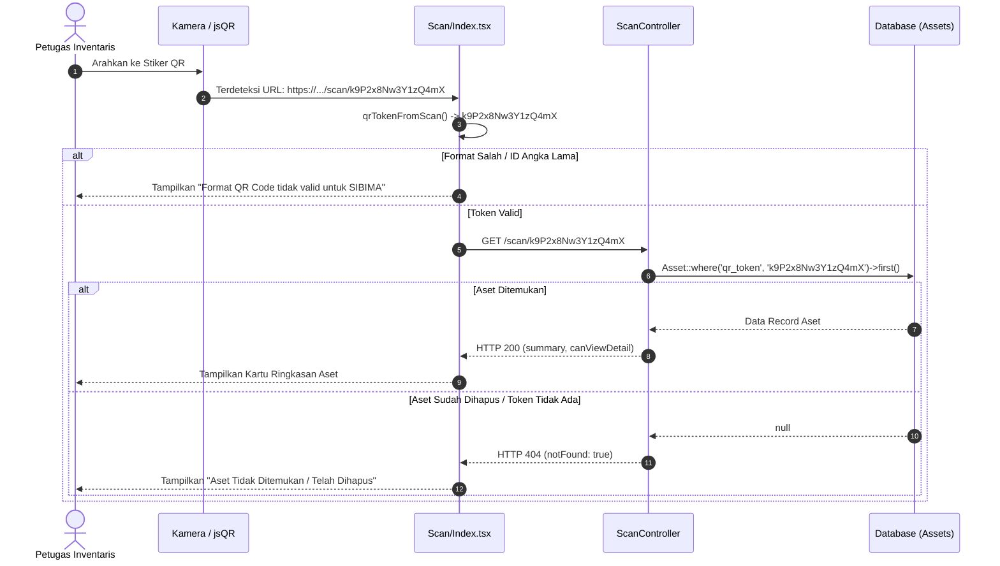

# Desain Spesifikasi: Unique QR Token untuk Aset BMD

- **Status**: Siap Ditinjau (*Pending Review*)
- **Tanggal**: 2026-10-10
- **Penulis**: Pair Programming AI & Tim Pengembang SIBIMA

---

## 1. Konteks & Latar Belakang

Pada implementasi awal SIBIMA, QR code aset dikodekan langsung menggunakan primary key database numerik (`/scan/{id}`). 

### Permasalahan yang Ditemukan:
1. **Risiko Bentrok Setelah Penghapusan**: Jika suatu aset fisik dengan `id = 1` telah dicetak stiker QR-nya lalu datanya dihapus dari sistem, kemudian user menginput barang baru dengan nomor register yang sama, maka:
   - Apabila database mengalokasikan ID baru (`id = 2`), stiker fisik lama pada barang akan mati (*404 Not Found*) dan tidak dapat mengenali barang baru tersebut.
   - Apabila database me-reuse ID (misal setelah truncate/reset counter), stiker fisik lama akan secara keliru membaca barang baru yang sama sekali berbeda fisiknya.
2. **Ketergantungan ID Database Internal**: Mengekspos urutan integer auto-increment database ke publik (*insecure direct object reference*) dan rentan rusak apabila terjadi migrasi data, import massal ulang, atau penggabungan database antar unit.

### Tujuan Perubahan:
Memberikan identitas digital fisik yang unik, permanen, dan acak (*Unique Immutable QR Token*) untuk setiap record aset, sehingga **setiap stiker QR fisik dijamin 100% berbeda seumur hidup** dan tidak akan pernah salah mengenali barang baru atau tertukar dengan aset lain.

---

## 2. Keputusan Desain yang Disepakati

| No | Topik | Keputusan yang Disepakati |
|---|---|---|
| 1 | **Format Token** | String alfanumerik acak 16 karakter tanpa prefix (contoh: `k9P2x8Nw3Y1zQ4mX`), terdiri dari huruf besar, huruf kecil, dan angka (`[A-Za-z0-9]{16}`). |
| 2 | **Entropi & Keamanan** | $62^{16} \approx 4.7 \times 10^{28}$ kemungkinan kombinasi. Probabilitas bentrok (*collision*) adalah 0%. |
| 3 | **Visibilitas di Frontend** | **Hidden from UI**. Token ini tidak dimunculkan pada antarmuka web (tabel aset, form, detail aset) agar tidak menimbulkan polusi visual informasi teknis yang tidak relevan bagi auditor/petugas BMD. |
| 4 | **Format Stiker Fisik** | Teks pada label cetak tetap menampilkan informasi resmi BMD (Nama Aset, Kode Barang, No. Register, Tahun, Unit). Gambar QR menyimpan URL token unik. |
| 5 | **Kebijakan Kompatibilitas** | **Opsi B (Clean Break)**. Pemindai kamera hanya memproses QR berformat token unik baru. URL ID numerik lama (`/scan/{id}`) ditolak sebagai format usang/tidak valid. |
| 6 | **Lifecycle Pembuatan** | Otomatis dibuat di event `creating` model `Asset`. Berlaku seragam untuk input manual form, import Excel, maupun alur BAST. |
| 7 | **Data yang Sudah Ada** | Migrasi database akan melakukan *auto-backfill* untuk mengisi `qr_token` unik bagi semua data aset yang sudah ada saat ini. |

---

## 3. Arsitektur & Perubahan Sistem

### 3.1 Skema Database (`database/migrations/`)
Buat migrasi: `2026_10_10_000001_add_qr_token_to_assets_table.php`:
* Menambahkan kolom `qr_token`:
  ```php
  Schema::table('assets', function (Blueprint $table) {
      $table->string('qr_token', 16)->nullable()->unique()->after('id');
  });
  ```
* **Auto-Backfill di dalam Migrasi**:
  ```php
  // Mengisi token untuk data eksisting
  DB::table('assets')->whereNull('qr_token')->orderBy('id')->chunk(100, function ($assets) {
      foreach ($assets as $asset) {
          DB::table('assets')
              ->where('id', $asset->id)
              ->update(['qr_token' => Str::random(16)]);
      }
  });

  // Ubah menjadi non-nullable setelah terisi
  Schema::table('assets', function (Blueprint $table) {
      $table->string('qr_token', 16)->nullable(false)->change();
  });
  ```

### 3.2 Model `App\Models\Asset`
* Tambahkan `qr_token` ke dalam `$fillable` (untuk fleksibilitas seeder/factory).
* Tambahkan event handler `creating` di dalam `booted()`:
  ```php
  static::creating(function (Asset $asset) {
      if (empty($asset->qr_token)) {
          do {
              $token = Str::random(16);
          } while (static::where('qr_token', $token)->exists());

          $asset->qr_token = $token;
      }
  });
  ```

### 3.3 Layanan QR Code (`app/Services/QrCodeService.php`)
* Perbarui `urlForAsset(Asset $asset)` agar menggunakan token:
  ```php
  public function urlForAsset(Asset $asset): string
  {
      return rtrim(config('app.url'), '/').route('scan.show', ['token' => $asset->qr_token], false);
  }
  ```
* Ukuran QR matriks tetap kompak dan renggang (*low density*), menjamin pemindaian super cepat di kamera ponsel.

### 3.4 Backend Routing (`routes/web.php`)
* Perbarui definisi rute scan:
  ```php
  Route::get('/scan', [ScanController::class, 'index'])->name('scan.index');
  Route::get('/scan/{token}', [ScanController::class, 'show'])
      ->where('token', '[A-Za-z0-9]{16}')
      ->name('scan.show');
  ```

### 3.5 Controller Pemindai (`app/Http/Controllers/ScanController.php`)
* Ubah pencarian dari ID numerik menjadi string token:
  ```php
  public function show(Request $request, string $token): InertiaResponse|SymfonyResponse
  {
      $asset = Asset::with(['category', 'unit', 'currentHolder', 'photos'])
          ->where('qr_token', $token)
          ->first();

      if ($asset === null) {
          return Inertia::render('Scan/Index', [
              'summary' => null,
              'canViewDetail' => false,
              'notFound' => true,
          ])->toResponse($request)->setStatusCode(404);
      }

      return Inertia::render('Scan/Index', [
          'summary' => $this->summary->for($asset),
          'canViewDetail' => $request->user()->can('view', $asset),
          'notFound' => false,
      ]);
  }
  ```

### 3.6 Frontend Parser (`resources/js/lib/qr.ts` & `Pages/Scan/Index.tsx`)
* Ganti `assetIdFromQr` dengan fungsi `qrTokenFromScan(text: string): string | null`:
  ```typescript
  export function qrTokenFromScan(text: string): string | null {
      let path: string;
      try {
          path = new URL(text.trim()).pathname;
      } catch {
          const raw = text.trim();
          return /^[A-Za-z0-9]{16}$/.test(raw) ? raw : null;
      }

      const match = path.match(/^\/scan\/([A-Za-z0-9]{16})\/?$/);
      return match ? match[1] : null;
  }
  ```
* Pada `resources/js/Pages/Scan/Index.tsx`:
  - `handleDetect`: panggil `qrTokenFromScan(text)`.
  - Jika `null`, set status `invalid: true` (menampilkan peringatan QR bukan label aset SIBIMA valid).
  - Jika valid, arahkan ke `route('scan.show', { token })`.

---

## 4. Alur Data & Skenario Kasus Uji



---

## 5. Rencana Pengujian Otomatis (*Automated Testing*)

1. **`tests/Feature/AssetQrTokenTest.php`**:
   - `it('automatically assigns a 16-character alphanumeric qr_token on creation')`: Memastikan setiap aset baru memiliki `qr_token` valid.
   - `it('ensures qr_tokens are globally unique')`: Menguji bahwa 2 aset yang dibuat tidak mungkin memiliki token yang sama.
   - `it('generates different qr_token for newly recreated asset with same register number')`: Memastikan skenario penghapusan aset lama dan input ulang dengan register sama menghasilkan token berbeda.
2. **`tests/Feature/ScanTokenTest.php`**:
   - `it('resolves asset summary by valid qr_token')`: Memastikan scan token valid mengembalikan data yang benar.
   - `it('returns 404 for deleted or nonexistent token')`: Memastikan stiker lama yang asetnya telah dihapus menghasilkan 404.
   - `it('rejects old numeric id urls via route regex')`: Memastikan URL format lama seperti `/scan/1` ditolak (404).
3. **`tests/Unit/QrParserTest.ts`** (atau TypeScript verifikasi):
   - Uji parsing token dari berbagai format URL dan penolakan format yang tidak cocok.
4. **Regresi Total**:
   - Seluruh test suite Pest (`php artisan test`) tetap 100% lulus.
   - Typecheck frontend (`npx tsc --noEmit`) dan build asset (`npm run build`) tanpa error.

---

## 6. Checklist Verifikasi & Batasan

- [x] Token unik murni untuk internal scanner, tidak diekspos di tabel web.
- [x] Stiker cetak PDF fisik tetap formal dan resmi.
- [x] Clean break: scanner tidak mengizinkan bypass ID numerik lama.
- [x] Seluruh aset lama di-backfill saat migrasi berjalan.
- [x] Nol regresi pada 553 test suite yang ada.
